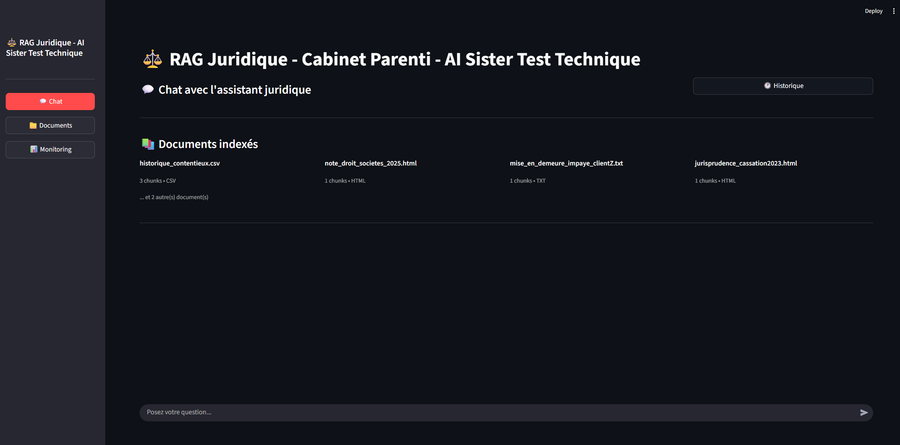
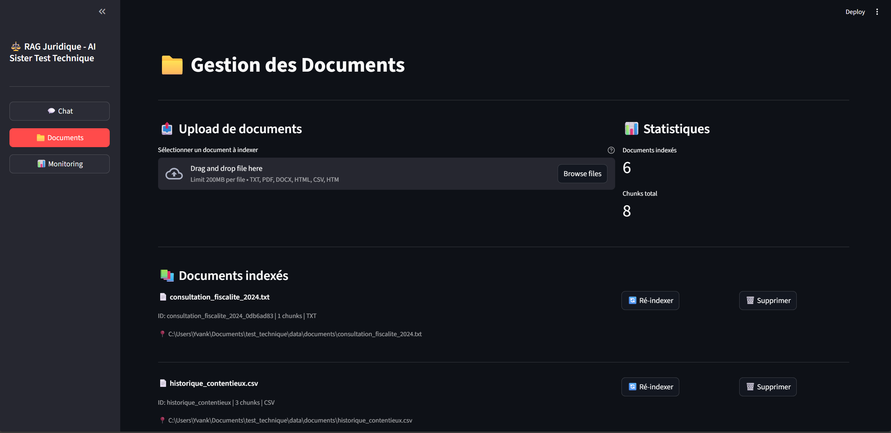
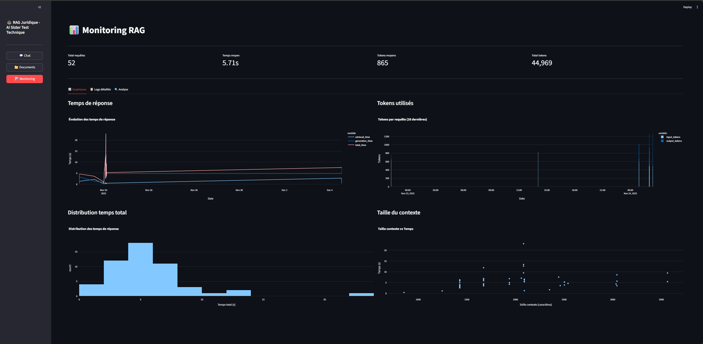
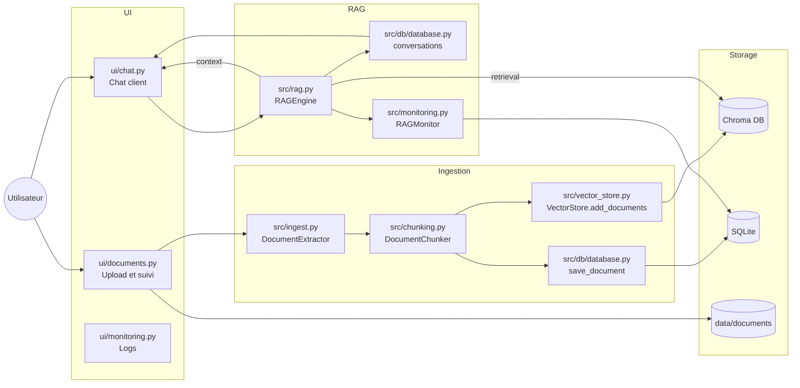
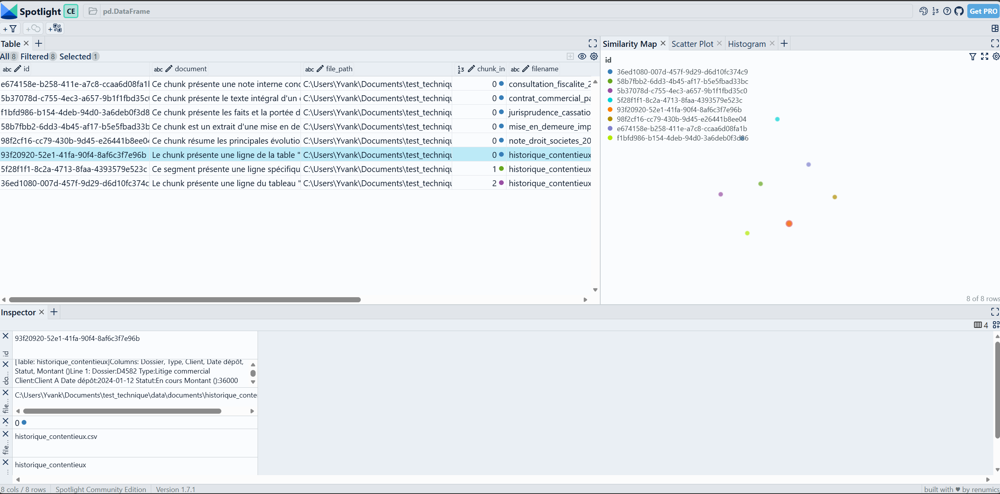

## Application RAG Juridique

**RAG Juridique** est une application intelligente basée sur la Génération Augmentée par Récupération (RAG) qui permet d'interroger des documents juridiques et contractuels en langage naturel. L'application indexe automatiquement vos documents, les divise en chunks contextuels et les transforme en embeddings vectoriels pour une recherche sémantique précise. Grâce à l'intégration avec OpenAI, elle génère des réponses pertinentes et sourcées directement depuis vos données, offrant une expérience conversationnelle complète avec historique et métriques de performance.



## Mise en route

Ce document décrit le processus de mise en place complet de l'application RAG juridique. Les instructions ci-dessous fonctionnent sur Windows (PowerShell), macOS et Linux.

### 1. Prérequis logiciels
- Python 3.10+ (`python --version` ou `python3 --version` pour vérifier)
- `git` pour cloner le dépôt
- Accès réseau à l'API OpenAI (clé valide requise)

### 2. Installation

**Windows (PowerShell) :**
```powershell
git clone <url-du-repo> test_technique
cd test_technique
python -m venv .venv
.venv\Scripts\activate
pip install --upgrade pip
pip install -r requirements.txt
```

**macOS / Linux :**
```bash
git clone <url-du-repo> test_technique
cd test_technique
python3 -m venv .venv
source .venv/bin/activate
pip install --upgrade pip
pip install -r requirements.txt
```

### 3. Configuration de l’environnement
1. Copier l’exemple suivant dans un fichier `.env` à la racine du projet :
   ```
   OPENAI_API_KEY=sk-...
   ```
2. Les répertoires `data/`, `data/documents/` et `data/chroma_db/` sont créés automatiquement. Conserver ces dossiers pour éviter toute perte d’index.

### 4. Démarrage de l'application

**Windows (PowerShell) :**
```powershell
streamlit run main.py
```

**macOS / Linux :**
```bash
streamlit run main.py
```

L’interface s’ouvre dans le navigateur et propose trois onglets principaux.

#### Chat
L’onglet Chat permet d’interroger le moteur RAG sur les documents indexés. Chaque question déclenche une recherche dans la base vectorielle, puis une génération de réponse basée sur les chunks pertinents. L’historique des conversations est conservé et peut être consulté ou repris. Les sources utilisées pour chaque réponse sont affichées avec leur contexte.


#### Documents
L'onglet Documents gère l'ingestion des fichiers. L'utilisateur peut uploader des documents (TXT, PDF, DOCX, HTML, CSV), visualiser les statistiques d'indexation et réindexer ou supprimer des documents existants. Chaque document est découpé en chunks, enrichi avec un contexte généré par le LLM, puis vectorisé et stocké dans Chroma.



#### Monitoring
L'onglet Monitoring affiche les métriques des appels RAG : temps de retrieval et de génération, nombre de tokens consommés, nombre de sources utilisées. Des graphiques permettent d'analyser l'évolution des performances et l'usage des ressources OpenAI.



### 5. Ingestion initiale
1. Depuis l’onglet Documents, importer des fichiers `.txt`, `.pdf`, `.docx`, `.html` ou `.csv`.
2. Chaque import passe par `DocumentExtractor` (`src/ingest.py`), `DocumentChunker` (`src/chunking.py`) puis `VectorStore.add_documents` (`src/vector_store.py`).
3. Les métadonnées sont persistées via `Database.save_document` (`src/db/database.py`) et les fichiers sources sont déposés sous `data/documents/` pour faciliter une réindexation ultérieure.

### 6. Tests et évaluation automatisée
Le dossier `eval/` contient les scripts suivants :
- `python eval/generate_dataset.py` pour générer un dataset synthétique.
- `python -m pytest eval/test_rag.py` pour exécuter la suite de non-régression.
- `python eval/metrics.py` pour calculer les métriques personnalisées sur les jeux fournis dans `eval/eval/`.

### 7. Architecture technique



- L’ingestion ajoute les embeddings côté Chroma et consigne les métadonnées dans SQLite. Les fichiers bruts sont conservés pour permettre la réindexation.
- Pendant le chat, `RAGEngine` enrichit la question grâce aux chunks pertinents, enregistre les messages et publie les métriques via `RAGMonitor`.


### 8. Visualisation des embeddings
Le notebook `src/visualize_embeddings.ipynb` offre une vue interactive des embeddings stockés dans Chroma via Renumics Spotlight.



1. Installer les dépendances nécessaires si besoin :
   ```bash
   pip install jupyter renumics-spotlight
   ```
   Les extensions Cleanlab ou Cleanvision sont optionnelles, les avertissements correspondants peuvent être ignorés.
2. Vérifier que l'index Chroma contient au moins un document (`data/chroma_db/` avec la collection `legal_documents`).
3. Démarrer Jupyter depuis la racine du projet :
   ```bash
   jupyter notebook src/visualize_embeddings.ipynb
   ```
4. Exécuter toutes les cellules :
   - `chroma_to_dataframe` charge jusqu'à 5 000 points et assemble un DataFrame Pandas avec documents, métadonnées et vecteurs.
   - `visualize_with_spotlight` ouvre l'interface Spotlight pour parcourir les embeddings (projection, recherche, filtrage).

Le notebook peut aussi être lancé en mode script pour un contrôle rapide :

**Windows (PowerShell) :**
```powershell
python - <<'PY'
from src.visualize_embeddings import chroma_to_dataframe
df = chroma_to_dataframe("../data/chroma_db", "legal_documents")
print(f"{len(df)} embeddings chargés.")
PY
```

**macOS / Linux :**
```bash
python3 - <<'PY'
from src.visualize_embeddings import chroma_to_dataframe
df = chroma_to_dataframe("../data/chroma_db", "legal_documents")
print(f"{len(df)} embeddings chargés.")
PY
```

### 9. Dépannage rapide
- Si aucun document n’est trouvé, vérifier que `data/chroma_db/` contient bien les fichiers générés et que `data/database.db` a été mis à jour.
- En cas d’erreur 401/429, confirmer la validité de la clé API et le niveau de quota.
- Pour réinitialiser l’index, supprimer `data/chroma_db/` et `data/database.db`, puis relancer l’ingestion depuis l’onglet Documents.
